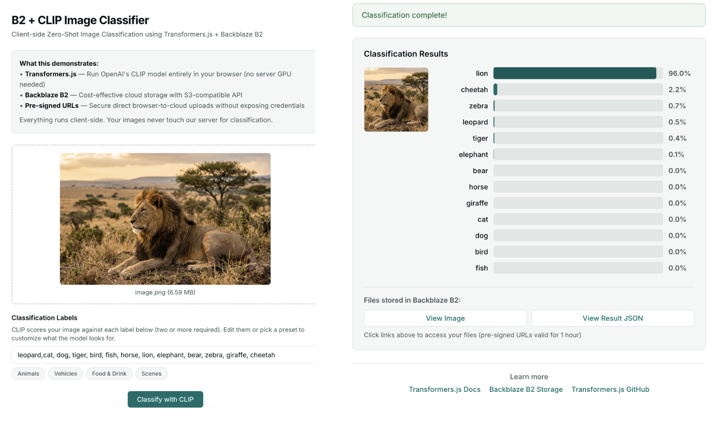

# Zero-Shot Image Classification in the Browser with CLIP and Backblaze B2

A JavaScript example app that runs [OpenAI's CLIP](https://openai.com/research/clip) zero-shot image classification model entirely in the browser using [Transformers.js](https://huggingface.co/docs/transformers.js) and WebAssembly — no server GPU required. Images and classification results are stored in [Backblaze B2](https://www.backblaze.com/cloud-storage?utm_source=github&utm_medium=referral&utm_campaign=ai_artifacts&utm_content=imagesamples) cloud storage.

Upload an image (JPG, PNG, GIF, WebP, BMP), provide custom labels, classify it with CLIP client-side, and save both the image and results to S3-compatible Backblaze B2 object storage — all from a single-page web app.



## Why Client-Side CLIP?

- **No GPU server costs** — the CLIP model runs in your browser via WebAssembly, so there's no inference server to provision or pay for
- **Privacy** — images never leave the user's device for classification
- **Simple to deploy** — a static frontend + a lightweight Node.js backend for pre-signed URLs is all you need

## Technologies

- **[Transformers.js](https://huggingface.co/docs/transformers.js)** — Run Hugging Face AI models like CLIP in the browser with WebAssembly
- **[OpenAI CLIP](https://github.com/openai/CLIP)** — State-of-the-art open-source vision-language model for zero-shot image classification
- **[Backblaze B2](https://www.backblaze.com/cloud-storage?utm_source=github&utm_medium=referral&utm_campaign=ai_artifacts&utm_content=imagesamples)** — S3-compatible cloud object storage at $6/TB/month

## What This Demonstrates

- **Client-side AI classification**: Run OpenAI CLIP entirely in the browser — no server GPU required
- **Zero-shot flexibility**: Classify images with any custom labels — no retraining needed
- **Cost-effective cloud storage**: Store images and results in Backblaze B2
- **Secure direct uploads**: Browser-to-cloud uploads using S3 pre-signed URLs
- **Simple architecture**: End-to-end flow from upload → classify → store

## Architecture

```
User → Upload Image → B2 Storage
                    ↓
Browser CLIP (Transformers.js) → Classify with custom labels
                    ↓
        Results → B2 Storage
```

### Flow

1. User selects/drops image file in browser
2. Backend generates pre-signed PUT URL for B2
3. Browser uploads image directly to B2
4. User enters classification labels (or picks a preset)
5. Browser loads CLIP model (Xenova/clip-vit-base-patch32)
6. Browser classifies image locally against provided labels
7. Backend generates pre-signed PUT URL for results
8. Browser uploads classification results JSON to B2

## Quick Start

### Prerequisites

- **Node.js 18+**
- **[Backblaze B2 Account](https://www.backblaze.com/cloud-storage?utm_source=github&utm_medium=referral&utm_campaign=ai_artifacts&utm_content=imagesamples)** (free tier available)
  - Create a bucket
  - Generate an Application Key with `readFiles`, `writeFiles`, `writeBuckets` permissions

### 1. Clone & Install

```bash
git clone https://github.com/backblaze-b2-samples/b2-zeroshot-image-classifier.git
cd b2-zeroshot-image-classifier/backend
npm install
```

### 2. Configure B2 Credentials

```bash
cp .env.example .env
```

Edit `.env` with your [B2 credentials](https://www.backblaze.com/docs/cloud-storage-enable-backblaze-b2?utm_source=github&utm_medium=referral&utm_campaign=ai_artifacts&utm_content=imagesamples):

```env
B2_REGION=your_b2_region
B2_APPLICATION_KEY_ID=your_application_key_id
B2_APPLICATION_KEY=your_application_key
B2_BUCKET_NAME=your-bucket-name
B2_PUBLIC_URL_BASE=
MAX_RESULT_UPLOAD_TOKENS=1000
```

> Set `B2_REGION` from your bucket details page. The app derives the S3-compatible endpoint as `https://s3.<B2_REGION>.backblazeb2.com`. Set `B2_PUBLIC_URL_BASE` only when your bucket is public or fronted by a CDN; otherwise the app returns pre-signed download URLs.

For rolling deploys from older versions, keep the old and new variable names set until all replicas and rollback targets run this version or later. The new names take precedence and the server logs a deprecation warning when it falls back to an old name.

| Old name | New name |
| --- | --- |
| `B2_KEY_ID` | `B2_APPLICATION_KEY_ID` |
| `B2_APP_KEY` | `B2_APPLICATION_KEY` |
| `B2_BUCKET` | `B2_BUCKET_NAME` |
| `B2_ENDPOINT` | `B2_REGION` derives `https://s3.<B2_REGION>.backblazeb2.com` |

### 3. Start the App

```bash
npm start
```

**That's it!** The server automatically:
- Configures B2 CORS for browser uploads
- Serves both frontend and API
- Opens at `http://localhost:3000`

### 4. Use the App

1. Open **http://localhost:3000** in your browser
2. Upload an image (JPG, PNG, GIF, etc.)
3. Enter classification labels or pick a preset
4. Click **"Classify with CLIP"**
5. View results bar chart and access files in B2

> First run downloads the CLIP model (~350MB) - this may take a few minutes

## Manual CORS Setup

If auto-setup fails (missing permissions), run manually:

```bash
npm run setup-cors
```

**Required B2 Key Permissions**:
- `listBuckets`
- `readFiles`
- `writeFiles`
- `writeBucketSettings` — Required for CORS setup

**Alternative - B2 CLI**:

```bash
b2 update-bucket --cors-rules '[
  {
    "corsRuleName": "allowBrowserUploads",
    "allowedOrigins": ["*"],
    "allowedHeaders": ["*"],
    "allowedOperations": ["s3_put", "s3_get", "s3_head"],
    "maxAgeSeconds": 3600
  }
]' <bucket-name> allPublic
```

**Alternative - B2 Web Console**:
1. Go to https://secure.backblaze.com/b2_buckets.htm
2. Click your bucket -> Bucket Settings -> CORS Rules
3. Add the rules shown above

## Usage

1. Open the frontend in your browser
2. Ensure the Backend API URL is correct (default: `http://localhost:3000`)
3. Drag and drop an image or click to browse
4. Image automatically uploads to B2
5. Enter comma-separated labels or click a preset button
6. Click **"Classify with CLIP"**
7. Wait for classification (first run downloads model)
8. View bar chart results and access files in B2

## Deployment

### Deploy Backend

**Railway / Render / Fly.io**:
- Set environment variables from `.env`
- Deploy `backend/` directory
- Update frontend `apiUrl` to deployed URL

**Docker**:
```dockerfile
FROM node:18-alpine
WORKDIR /app
COPY backend/package*.json ./
RUN npm install
COPY backend/ ./
CMD ["node", "server.js"]
```

### Deploy Frontend

**Static Hosting** (Netlify, Vercel, Cloudflare Pages):
- Deploy `frontend/` directory
- Set API URL in settings or hardcode in `index.html`

**B2 Static Hosting**:
- Upload `frontend/index.html` to B2 bucket
- Enable website hosting on bucket
- Access via B2 website URL

## B2 Configuration

### Bucket Settings

1. Create bucket (Private or Public based on needs)
2. For public access to images/results, set bucket to Public
3. Enable CORS if frontend hosted on different domain:

```json
[
  {
    "corsRuleName": "allowAll",
    "allowedOrigins": ["*"],
    "allowedHeaders": ["*"],
    "allowedOperations": ["s3_put", "s3_get"],
    "maxAgeSeconds": 3600
  }
]
```

### Generate B2 Keys

```bash
# Using B2 CLI
b2 create-key <keyName> listBuckets,readFiles,writeFiles
```

Or use B2 Web UI -> App Keys -> Create Key

## API Endpoints

### POST /api/presign-image

Request:
```json
{
  "filename": "photo.jpg",
  "contentType": "image/jpeg"
}
```

Response:
```json
{
  "uploadUrl": "https://...",
  "publicUrl": "https://...",
  "urlType": "signed",
  "expiresIn": 3600,
  "key": "images/uuid.jpg",
  "fileId": "uuid",
  "resultUploadToken": "unguessable-token",
  "resultUploadTokenExpiresIn": 3600
}
```

`resultUploadToken` is a one-time signed token required when requesting the matching result upload URL. During the migration window, callers that omit `resultUploadToken` can still request one legacy result upload URL for a `fileId` issued by `/api/presign-image`; that fallback returns `results/<fileId>.json` and a deprecation notice.

### POST /api/presign-result

Request:
```json
{
  "fileId": "uuid",
  "resultUploadToken": "unguessable-token"
}
```

Response:
```json
{
  "uploadUrl": "https://...",
  "publicUrl": "https://...",
  "urlType": "signed",
  "expiresIn": 3600,
  "key": "results/<fileId>/<randomUUID>.json"
}
```

`urlType` describes `publicUrl`: `signed` URLs expire after `expiresIn` seconds, while `public` URLs come from `B2_PUBLIC_URL_BASE` and return `expiresIn: null`.
Each token-based result upload URL uses a new server-issued object key under the token's `fileId`, so browser clients can upload with only the `Content-Type: application/json` header and do not need forbidden conditional request headers. A result upload token can be exchanged only once.

## Technical Details

### CLIP Model

This example uses the [Xenova/clip-vit-base-patch32](https://huggingface.co/Xenova/clip-vit-base-patch32) model, a quantized version of OpenAI's CLIP optimized for in-browser inference via Transformers.js.

- **Model**: [Xenova/clip-vit-base-patch32](https://huggingface.co/Xenova/clip-vit-base-patch32) (ViT-B/32 vision encoder + text encoder)
- **Library**: [Transformers.js](https://huggingface.co/docs/transformers.js) — Run Hugging Face transformer models in the browser
- **Size**: ~350MB download (cached in browser after first load)
- **Task**: Zero-shot image classification — classify images against any set of text labels without retraining

### Storage

- **Provider**: [Backblaze B2](https://www.backblaze.com/b2/cloud-storage.html?utm_source=github&utm_medium=referral&utm_campaign=ai_artifacts&utm_content=imagesamples)
- **API**: S3-compatible API with pre-signed URLs and a custom sample user agent
- **Pricing**: $6/TB/month storage, uploads are FREE
- **Documentation**: [B2 S3-Compatible API Docs](https://www.backblaze.com/b2/docs/s3_compatible_api.html?utm_source=github&utm_medium=referral&utm_campaign=ai_artifacts&utm_content=imagesamples)

### Supported Image Formats

JPG, JPEG, PNG, GIF, WebP, BMP

### Browser Compatibility

- Chrome 90+
- Edge 90+
- Firefox 90+
- Safari 15.4+

Requires WebAssembly and ES6 modules support.

## Limitations

- First classification loads model (~350MB, one-time)
- ViT-B/32 is a base model — larger CLIP variants may be more accurate
- Browser must stay open during classification
- Maximum image size: 10 MB
- Requires at least 2 labels for meaningful zero-shot classification

## Potential Improvements

- [ ] Add webcam/camera capture
- [ ] Support larger CLIP models (ViT-L/14)
- [ ] Batch classification of multiple images
- [ ] Image segmentation with region-specific labels
- [ ] Multi-language label support
- [ ] Confidence threshold filtering
- [ ] Export results as CSV

## Related Resources

- **[Transformers.js Documentation](https://huggingface.co/docs/transformers.js)** — Run Hugging Face AI models in the browser with WebAssembly
- **[Transformers.js GitHub](https://github.com/xenova/transformers.js)** — Source code and examples
- **[OpenAI CLIP](https://github.com/openai/CLIP)** — Original CLIP vision-language model
- **[CLIP Models on Hugging Face](https://huggingface.co/models?search=clip)** — Pre-trained CLIP model variants
- **[Backblaze B2 Documentation](https://www.backblaze.com/b2/docs/?utm_source=github&utm_medium=referral&utm_campaign=ai_artifacts&utm_content=imagesamples)** — Cloud storage API docs
- **[B2 S3-Compatible API](https://www.backblaze.com/b2/docs/s3_compatible_api.html?utm_source=github&utm_medium=referral&utm_campaign=ai_artifacts&utm_content=imagesamples)** — Use standard S3 SDKs with Backblaze B2

## Troubleshooting

### CORS Error: "Access to fetch has been blocked by CORS policy"

**Problem**: Browser shows CORS error when uploading image.

**Solution**:
1. Run `npm run setup-cors` in the backend directory
2. Or manually configure CORS on your B2 bucket (see Setup section)
3. Verify CORS is set: Go to B2 Console -> Your Bucket -> Settings -> CORS Rules

**Required CORS settings**:
- Allowed Origins: `*` (or specific origins like `http://localhost:8080`)
- Allowed Methods: `GET`, `PUT`, `HEAD`
- Allowed Headers: `*`

### Backend Connection Error

**Problem**: Frontend can't connect to backend API.

**Solution**:
1. Verify backend is running: `curl http://localhost:3000/health`
2. Check API URL in frontend matches backend (default: `http://localhost:3000`)
3. Look for CORS errors in backend logs

### Classification Fails or Hangs

**Problem**: CLIP model fails to load or classify.

**Solution**:
1. **First run takes time**: Model downloads ~350MB, wait a few minutes
2. **Check browser console**: Look for specific errors
3. **Try smaller image**: Test with a small JPG first
4. **Clear cache**: Hard refresh browser (Ctrl+Shift+R / Cmd+Shift+R)
5. **Use supported browser**: Chrome, Edge, or Firefox recommended

### Upload Works but Can't Access Files

**Problem**: Files upload but URLs don't work.

**Solution**:
1. Check bucket is public or URLs are pre-signed
2. Verify endpoint URL matches bucket region
3. Try accessing URL directly in browser
4. Check B2 bucket lifecycle rules aren't deleting files

### ContentScript.bundle.js Errors

**Problem**: Console shows errors from `contentScript.bundle.js`.

**Solution**: These are from browser extensions. Safe to ignore - they don't affect the app.

## License

This project is licensed under the MIT License. See the [LICENSE](LICENSE) file for details.
